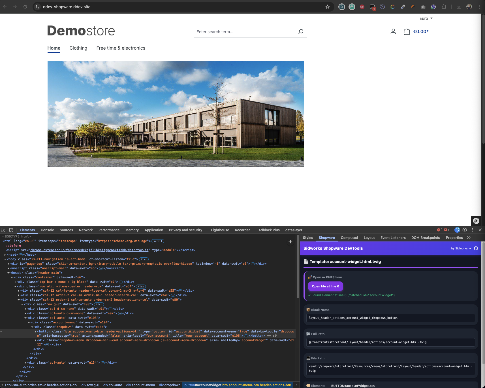

# Sidworks DevTools for Shopware 6

Never hunt for a Twig file again. Sidworks DevTools reveals the exact template and block behind every Shopware 6 element and lets you jump straight into your IDE with a single click.



## Features

### Shopware Plugin
- **Smart Template Tracking**: Automatically tracks every Twig block with detailed metadata (template name, file path, line number, parent template)
- **HTML Markers**: Injects lightweight HTML comments (`<!-- SWDT:ID -->`) to map elements to their source templates
- **Intelligent Line Detection API**: Backend endpoint that searches template files to find the exact line of your selected element (not just the block start)
- **Security First**: Only active in debug mode (`APP_ENV=dev`) with configurable on/off switch
- **Zero Production Impact**: Completely disabled in production environments

### [Chrome extension](https://github.com/sidworks-dev/sw-plugin-devtools-chrome-extension)
- **DevTools Sidebar Integration**: Adds a "Shopware" panel in Chrome's Elements sidebar
- **Instant Template Info**: Select any element to see its template, block name, file path, and inheritance chain
- **Smart IDE Integration**: One-click to open templates at the exact line in PHPStorm or VSCode
- **Intelligent Line Search**: Automatically finds the precise element line by searching for classes, IDs, and tags
- **Multi-Editor Support**: Works with PHPStorm and VSCode

### Optimized Storefront Watcher
- **Single command flow**: Use `bin/console sidworks:watch` (no shell wrapper required)
- **Fast hot mode defaults**: Narrow Twig watch scope, filesystem cache, source maps off by default
- **`sass-embedded` enabled**: Uses embedded Sass compiler in hot mode (falls back to `sass` if unavailable)
- **Core hot-proxy override**: Keeps hot runtime customizations in plugin space instead of `vendor/shopware/*`

## Requirements

- Shopware 6.6.x or 6.7.x
- PHP 8.1 or higher
- Chrome or Edge browser (for extension)
- Node.js 20+ (required for storefront watcher)
- [Bun](https://bun.sh) optional (set `SHOPWARE_STOREFRONT_WATCH_PM=bun` to use it)

## Installation

### Plugin Installation

#### Via Composer (Recommended)

```bash
composer require sidworks/sw-plugin-devtools --dev
bin/console plugin:refresh
bin/console plugin:install --activate SidworksDevTools
bin/console cache:clear
```

#### Manual Installation

1. Clone or download this repository to `custom/plugins/SidworksDevTools`
2. Run the following commands:

```bash
bin/console plugin:refresh
bin/console plugin:install --activate SidworksDevTools
bin/console cache:clear
```

### Chrome Extension Installation

1. Download [Chrome extension](https://github.com/sidworks-dev/sw-plugin-devtools-chrome-extension)
2. Open Chrome and navigate to `chrome://extensions/`
3. Enable **Developer mode** (toggle in top right)
4. Click **Load unpacked**
5. Select the extension directory
6. The extension icon will appear in your toolbar

## Configuration

### Plugin Configuration

1. Ensure Shopware is running in debug mode: set `APP_ENV=dev` in your `.env` file
2. (Optional) Navigate to **Settings** → **System** → **Plugins** in Shopware admin
3. Find **Sidworks DevTools** and click **Configuration** to enable/disable

### Extension Configuration

1. Click the extension icon and select **Options**
2. Set your **Project Path** (e.g., `/Users/yourname/Projects/shopware`)
3. Choose your preferred **Editor** (PHPStorm or VSCode)
4. Enable/disable **IDE Integration**

The project path should be the absolute path to your Shopware root directory.

**Tip for Docker/DDEV users**: Add the `PROJECT_PATH` environment variable to your `docker-compose.yml` or `.ddev/config.yaml`:

```yaml
web_environment:
  - PROJECT_PATH=/Users/yourname/Development/your-shopware-project
```

The plugin will automatically inject this path into the page, so you don't need to manually configure it in the extension options.

## Usage

### Storefront Watcher (`sidworks:watch`)

Run from your project root:

```bash
bin/console sidworks:watch
```

Defaults:
- Fast profile is always on
- Browser auto-open is off by default

This command:
1. Runs in fast mode by default (`skip-postcss`, `scss-engine=sass-cli`)
2. Ensures storefront dependencies exist
3. Auto-installs `sass-embedded` in the storefront app when missing
4. Starts the plugin hot-proxy runtime directly (no `watch.sh`/`watch.mjs` wrapper)
5. Uses `sass-embedded` by default via `SHOPWARE_STOREFRONT_USE_SASS_EMBEDDED=1`

Only runtime toggles:

```bash
bin/console sidworks:watch --no-js
bin/console sidworks:watch --no-twig
bin/console sidworks:watch --no-scss
```

### Storefront Hot Proxy Override

This plugin also ships a standalone copy of the Shopware storefront hot-proxy runtime under:

`<plugin-root>/bin/storefront-hot-proxy/`

`<plugin-root>` can be either:
- `custom/plugins/SidworksDevTools`
- `vendor/sidworks/sw-plugin-devtools` (Composer/vendor install)

The project root watcher (`bin/watch-storefront.sh`) automatically uses this runtime when present, so you can keep watcher/performance changes outside `vendor/shopware/*`.

Useful flags for this runtime:
- `--core-only-hot`: only compile core storefront in hot mode
- `--skip-postcss`: skip PostCSS step in hot mode
- `--full-twig-watch`: disable narrow Twig watch mode

### Template Inspector — Basic Workflow

1. **Enable debug mode** in Shopware (`.env`: `APP_ENV=dev`)
2. **Install both** the plugin and [Chrome extension](https://github.com/sidworks-dev/sw-plugin-devtools-chrome-extension)
3. **Visit your storefront** in Chrome
4. **Open DevTools** (F12 or right-click → Inspect)
5. **Select any element** in the Elements panel
6. **View template info** in the "Shopware" sidebar on the right
7. **Click the IDE link** to jump directly to the template file at the exact line

### What You'll See

When you inspect an element, the sidebar shows:

- **Template Type**: Page, Component, or Utility
- **Block Name**: The Twig block that rendered this element
- **Template Path**: Full Shopware namespace path (e.g., `@Storefront/storefront/page/product-detail/index.html.twig`)
- **Parent Template**: The template this one extends (inheritance chain)
- **File Path**: Relative filesystem path
- **IDE Link**: Click to open in PHPStorm/VSCode at the exact element line
- **Element Info**: Tag name, ID, and classes

### Smart Line Detection

The extension doesn't just open templates at the block start—it searches for the exact line:

1. **Exact ID match**: `id="product-detail-123"` → finds exact match
2. **Partial ID match**: `id="product-{{ product.id }}"` → matches static prefix
3. **Multi-class match**: `class="btn btn-primary"` → tries all combinations
4. **Parent context**: Uses parent element classes to disambiguate similar elements
5. **Dynamic class prefix**: `class="card-{{ type }}"` → matches `card-` prefix
6. **Tag fallback**: Falls back to tag name (`<div>`, ``) if needed

### Example Output

```
📄 Page Template: index.html.twig

🚀 Open in PHPStorm
  └─ Open file at line 42
  └─ ✓ Found element at line 42 (matched: product-detail-content)

📦 Block Name: page_product_detail

📂 Full Path: @Storefront/storefront/page/product-detail/index.html.twig

⬆️ Extends: @Storefront/storefront/base.html.twig

💻 File Path: vendor/shopware/storefront/Resources/views/storefront/page/product-detail/index.html.twig

🏷️ Element: DIV#product-123.product-detail-content
🎨 Classes: product-detail-content container
```

## How It Works

### Backend (Plugin)

1. **TemplateDebugNodeVisitor**: Twig compiler visitor that wraps every block with tracking functions
2. **TemplateDebugExtension**: Twig extension providing `swdt_track_block()`, `swdt_start_marker()`, and `swdt_end_marker()`
3. **TemplateRegistry**: In-memory registry collecting all template metadata during page render
4. **ResponseSubscriber**: Injects collected data into HTML response as JSON and wraps elements with `data-swdt` attributes
5. **TemplateSearchController**: API endpoint (`/_action/sidworks-devtools/find-line`) that searches template files to find exact element lines

### Frontend (Extension)

1. **content.js**: Content script that detects DevTools data on page
2. **background.js**: Service worker managing extension state
3. **devtools-init.js**: Creates the "Shopware" sidebar panel
4. **inspector.js**: Sidebar logic that reads element data and communicates with the page
5. **Smart search**: Sends element classes/ID/tag to backend API to find exact line in template file

## Security

- **Debug Mode Only**: Plugin is completely disabled when `APP_ENV=prod`
- **Configurable**: Can be disabled even in debug mode via plugin settings
- **Input Validation**: API endpoint validates all inputs (class names, IDs, file paths)
- **Path Traversal Protection**: Only allows reading `.twig` files within project directory
- **No Production Data**: No overhead or data collection in production

## Browser Compatibility

The [Chrome extension](https://github.com/sidworks-dev/sw-plugin-devtools-chrome-extension) works with:
- Google Chrome (Manifest V3)
- Microsoft Edge (Chromium-based)
- Brave
- Other Chromium-based browsers

## License

MIT License - See [LICENSE](LICENSE.md) file for details

## Author

**Sidworks**
Website: [www.sidworks.nl](https://www.sidworks.nl)

## Contributing

Contributions are welcome! Please feel free to submit issues or pull requests.

**Important**: This project consists of two components that work together:
- **[Shopware Plugin](https://github.com/sidworks-dev/sw-plugin-devtools)**
- **[Chrome extension](https://github.com/sidworks-dev/sw-plugin-devtools-chrome-extension)**

When updating the plugin, ensure you also update the extension if the changes affect the data format or API. Similarly, when updating the extension, verify compatibility with the plugin. Both components should be kept in sync.

## Support

For issues and questions:
- Create an issue on GitHub
